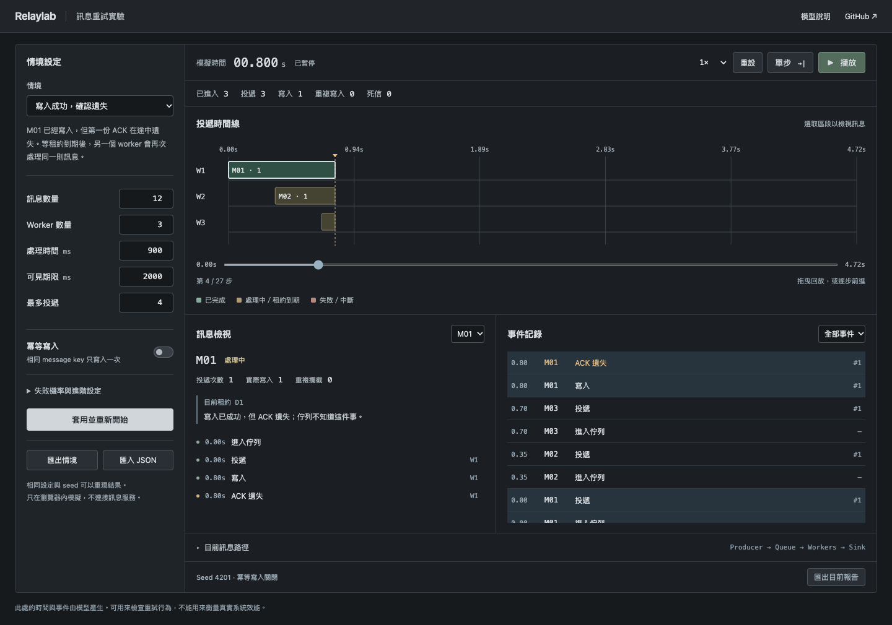

# Relaylab

A small queue simulator for examining retries, expired delivery receipts, and duplicate writes. Adjust the scenario, step through worker deliveries, and inspect the event trace. The browser and CLI share the same deterministic engine.

[Open the lab](https://miiduoa.github.io/relaylab/) · [Model and design](docs/model.md) · [Scenario format](docs/scenarios.md)



The first experiment starts at a deliberate ACK loss. Press **播放** to continue, select a delivery in the worker timeline, or scrub backward through the exact same event sequence. Turn on **冪等寫入**, apply the settings, and compare the result.

| Default experiment            | Deliveries | Committed effects | Duplicate effects |
| ----------------------------- | ---------: | ----------------: | ----------------: |
| Lost ACK, idempotency off     |         13 |                13 |                 1 |
| Same scenario, idempotency on |         13 |                12 |                 0 |

The duplicate delivery is still there. The second write is what gets suppressed.

## Experiments

- **The lost ACK** — the side effect commits, the first ACK for M01 disappears, and visibility timeout triggers another delivery.
- **Retry pressure** — processing failures back off exponentially and eventually exhaust the attempt budget.
- **Overlapping delivery** — a worker takes longer than its visibility lease. Old work can still write an effect, but its stale receipt cannot acknowledge the newer delivery.
- **Worker recovery** — a worker crashes before committing, comes back later, and leaves the unacknowledged message to expire in the meantime.

Each scenario supports up to 60 messages and 6 workers. Inspect individual messages, filter the event log, export the scenario, and export a report containing the current trace and state. Reports may be partial; `result.complete` distinguishes a finished run.

## Run locally

Use Node.js **24 or newer**. No API keys or backend are needed.

```sh
npm ci
npm run dev
```

Open the `/relaylab/` URL printed by Vite. The UI is in Traditional Chinese, with the underlying delivery concepts labeled in English.

```sh
npm test             # deterministic examples, race regressions, 100 varied scenarios
npm run typecheck
npm run build
npm run preview
```

## The same engine, without the UI

```sh
npm run simulate -- --preset lost-ack --out lost-ack.json
npm run simulate -- --preset lost-ack --idempotent --out idempotent.json
npm run simulate -- --preset short-lease --seed 73 --out short-lease.json
npm run simulate -- --scenario my-scenario.json --out report.json
```

The CLI refuses to overwrite an existing output file. Omit `--out` to print the JSON report; when piping pure JSON, use `node src/cli.ts` directly or `npm run --silent simulate`. A browser-exported **scenario** can be loaded by the CLI. A **report** is a separate, deliberately richer format and is not an importable scenario.

## Implementation

The simulation core has no DOM, timers, filesystem, framework, or runtime dependencies. A stable event scheduler advances one virtual timestamp at a time. Mulberry32 supplies seeded random draws. The browser and CLI both use this core; playback timers only decide when to request the next transition.

The timeline shows actual deliveries seen so far. Scrubbing reconstructs the state from the seed and a transition index, rather than mutating a stored screenshot. Completed and expired receipt IDs stay distinct, which makes races between old workers and new leases observable.

```
src/core/engine.ts     event scheduler, leases, workers, effects, snapshots
src/core/scenario.ts   bounded schema, validation, four experiments
src/main.ts           browser controls and SVG views
src/cli.ts            file input/output around the same engine
tests/engine.test.ts   regressions and conservation checks
```

This extends an earlier, smaller [Eventlane experiment](https://miiduoa.github.io/labs/eventlane/) into a separate investigation of time and receipt races. Eventlane explores manual delivery actions; Relaylab adds overlapping worker execution, visibility leases, seeded fault scheduling, replay, and a shared CLI engine. It does not reuse Eventlane's simulation implementation.

## Model boundaries

This is an educational discrete-event model, **not a broker emulator or load test**. It assumes a single queue, a perfect atomic idempotency store keyed by message ID, and deterministic same-time ordering. Failures and crashes occur before the write; ACK loss happens after it. Idempotency records never expire. There is no network, database, transaction isolation, or real I/O model.

**Dead-lettering does not undo side effects.** A visibility lease may expire and exhaust the retry budget while an old worker is still running. That worker can write later. The short-lease preset intentionally exposes this case; “dead” is a queue state, not proof that the business action never happened.

See [the model notes](docs/model.md) for transition rules and the guarantees the tool does and does not make.

## Publishing

The included GitHub Actions workflow runs tests and a type-checked production build before deploying `dist/` to GitHub Pages. Enable **GitHub Actions** as the Pages source in repository settings. Pull requests run verification only. `vite.config.ts` sets the base path to `/relaylab/`; change it if you rename the repository or use a custom domain.

MIT licensed.
