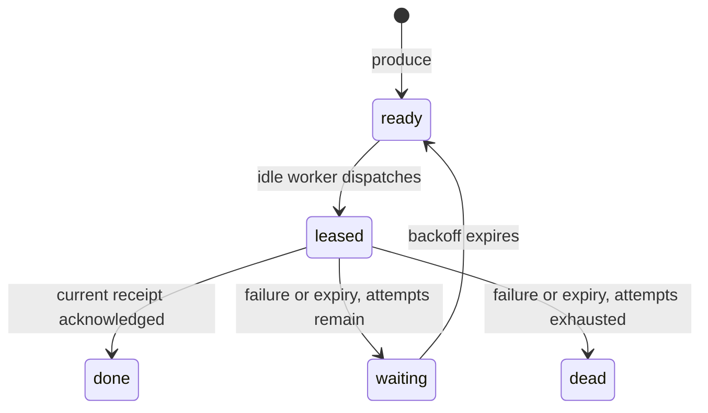

# Model notes

Relaylab models the gap between committing an effect and acknowledging a queue delivery. It is small enough that the whole state machine can be inspected.

## One virtual clock

Events have an integer timestamp and an insertion order. The scheduler chooses the earliest timestamp, breaking ties by insertion order. A worker's completion is scheduled before its corresponding visibility expiry. If both occur at exactly the same timestamp, completion is processed first and can acknowledge the lease.

This is a declared arbitration rule, not a statement about timing in real distributed systems. Changing it would change the simulation's semantics and requires a regression test.

The random generator draws a processing-duration jitter and a crash decision at dispatch. A non-crashing completion draws a processing-failure decision; a success then draws an ACK-loss decision. All random decisions come from one Mulberry32 sequence. Replay preserves draw order by reconstructing the engine and executing the same transitions.

## Queue state and worker state are different

Messages move through `ready`, `leased`, `waiting`, `done`, and `dead`. Workers move independently through `idle`, `busy`, and `down`. A message's latest lease points to a unique delivery ID; each delivery also records its worker and attempt number.

A visibility timeout invalidates the receipt, not the execution. The old worker may remain busy while another worker processes a new delivery. On a successful completion:

1. Commit the effect, or suppress it when the idempotency key already exists.
2. Determine whether the ACK is lost.
3. Accept the ACK only when the message is still leased to that delivery ID.

An old delivery's failure also cannot release a newer delivery's lease. This case is covered by a dedicated regression test.

## Retry and crash rules

- A processing failure occurs before the effect. If it owns the current lease, it invalidates that lease and schedules a retry.
- A crash occurs halfway through its sampled processing duration and before the effect. It marks the worker down; its message remains leased until expiry.
- A worker recovers after `recoveryTime`. Recovery does not restore the abandoned execution.
- The retry delay is `backoff × 2^(attempts - 1)`. The attempt budget counts all deliveries, including crashes, failures, and successful writes with lost ACKs.
- A ready message is selected in original arrival order from the ready set. This is not a strict FIFO completion guarantee.
- Finished or invalidated lease timers are removed. A successfully completed experiment does not keep advancing the clock merely to consume obsolete expiry events.

## What idempotency means here

The sink maintains a set of message IDs. In idempotent mode, checking the ID, recording it, and performing the effect are one atomic operation. The set persists for the entire simulation, without eviction or TTL. Turning the UI toggle on requires applying a fresh scenario; it does not retroactively rewrite an existing trace.

These assumptions are intentionally stronger than a naïve real-world “check, write, mark done” implementation. Relaylab does not model an idempotency database or prove that a production implementation is safe.

## Invariants and tests

At every transition:

- `queued + inFlight + acknowledged + dead = produced`.
- The clock never moves backward.
- No message exceeds `maxAttempts` deliveries.
- A busy worker has exactly one active delivery.
- With idempotency enabled, each message produces at most one effect.

After the scheduler empties, every produced message is acknowledged or dead, and all work/recovery events have been consumed. Some dead messages may have effects; this is expected when a stale worker completes after the final lease expires.

The test suite includes fixed outcome assertions, exact retry timing, same-time arbitration, stale-success and stale-failure receipts, crash/recovery timing, deterministic replay, detached snapshot mutations, malformed input, and invariants over 100 varied seeds and configurations. Browser layout, keyboard access, and file downloads need separate interaction checks.

## Boundaries and references

The visibility lease is informed by the general [SQS visibility timeout model](https://docs.aws.amazon.com/AWSSimpleQueueService/latest/SQSDeveloperGuide/sqs-visibility-timeout.html) and receipt-handle concepts in [ReceiveMessage](https://docs.aws.amazon.com/AWSSimpleQueueService/latest/APIReference/API_ReceiveMessage.html). Relaylab does not emulate SQS, RabbitMQ, Kafka, Redis Streams, or a vendor's redrive policy. Explicit local failure handling and retry backoff are Relaylab rules.

The model omits network topology, multiple producers, storage failures, broker replication, consumer heartbeats, lease extensions, transaction isolation, cancellation propagation, real throughput limits, clock skew, and idempotency-key expiry. All reported durations are virtual, not benchmark measurements.
